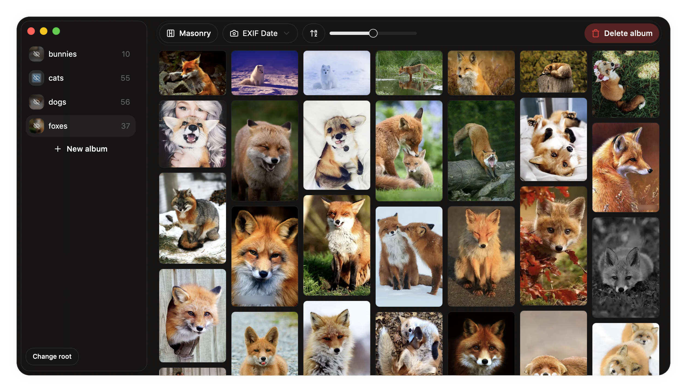

# Room 237

> [!WARNING]
> Disclamier: Project is provided "as is" without any warranty. Use at your own risk. This was a one-weekend project, so expect bugs and issues. It is recommended to keep a backup of your photos before using this app.

> [!IMPORTANT]
> Upon first start of Room 237, it will index the selected root directory to generate thumbnails, extract metadata, and convert HEIC files to PNG. This may take some time.

## Features

- **Lockscreen**: Need to leave your laptop for a second? Lock your gallery with a single click
- **Layouts**: Use classic grid, fancy masonry or Apple-Photos-like layout
- **Cropping**: Try clicking on any image
- **Lightweight**: No tracking BS, no ads, no statistics, not even cookies!
- **Feels native**: Select multiple photos to drag around, move them between albums, use hotkeys
- **Open Source**: Free and open source, GNU Affero General Public License v3.0

## Usage recommendations

To ensure the best privacy and performance, follow these recommendations:  

**MacOS**: 

1. Create an encrypted disk image on your primary drive ([Create a secure disk image](https://support.apple.com/et-ee/guide/disk-utility/dskutl11888/mac))
2. Use it (or any subdirectory on it) as a root for Room 237

**Windows**:

1. Do not use BitLocker, PLEASE. It is insecure
2. Use [VeraCrypt](https://www.veracrypt.fr/en/Home.html) to create an encrypted container
3. Use it (or any subdirectory on it) as a root for Room 237

**Linux**:

1. Use [VeraCrypt](https://www.veracrypt.fr/en/Home.html) to create an encrypted container
2. Use it (or any subdirectory on it) as a root for Room 237

Also...
1. Use Chrome. Not Chromium, not Opera, not MS Edge.
2. After opening the app, save it as a PWA
3. Do not use the app to manage a huge photo library. I tested it on ~4GB library and it handles it well, but I can't guarantee it will work with larger libraries

## Privacy Policy

I don't collect anything. The only thing I get is your IP address (this is how Internet works), and I don't store it. If you're worried, use VPN or self-host.

Feel free to visit https://room237.dgazizullin.dev and check the Network tab or source code.

## Planned

- [ ] Better memory and state management
- [ ] Actual live-reload from disk
- [ ] Wrap it in Electron
- [ ] Bug fixes
